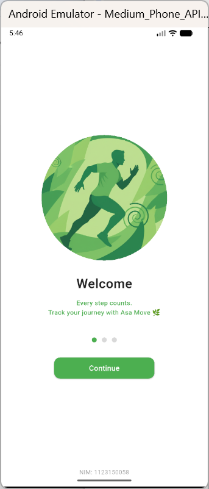
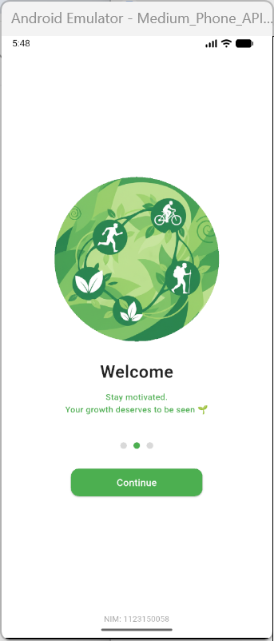
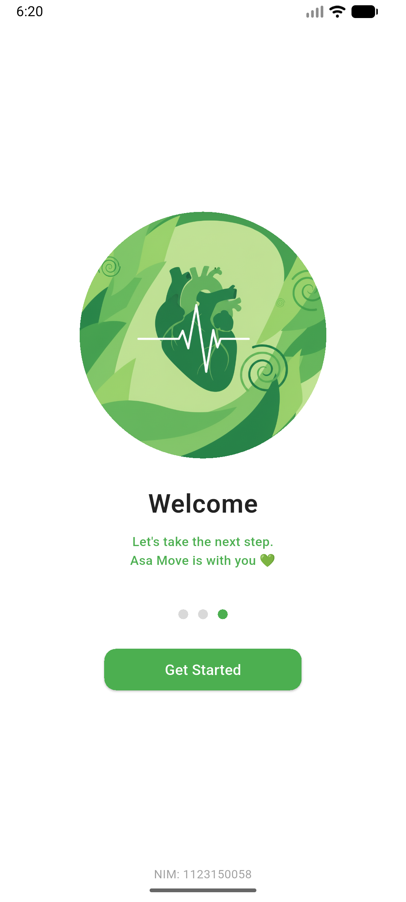

# 📱 UTS Flutter - AsaMove App

# 👤 Identitas
- Nama Lengkap  : Rismanita Lestari  
- NIM           : 1123150058  
- Kelas         : KB1179 
---

## 🖼️ Hasil Screenshot
Tampilan aplikasi pada Android Emulator:  

### Splash Screen 1


### Splash Screen 2


### Splash Screen 3


### Login Page


---

## 🚀 Cara Menjalankan Project
1. Pastikan Flutter SDK sudah terinstall.  
2. Jalankan perintah berikut di terminal:
   ```bash
   flutter pub get
   flutter run
````

3. Pilih device (Android Emulator atau Chrome).
4. Aplikasi akan terbuka dan menampilkan **Splash Screen 1** terlebih dahulu.

---

## 🧩 Deskripsi Singkat

AsaMove adalah aplikasi pelacak aktivitas seperti Strava, dengan tema hijau (`Colors.green`) sesuai ketentuan UTS.
Menampilkan 3 halaman splash screen dan halaman login dengan form **Phone Number** & **Password**, serta tombol login dan ikon media sosial.

---

## ⚠️ Catatan Kendala

* Banyak error saat install Android Emulator

---

## 💚 Terima Kasih

Dikerjakan untuk memenuhi UTS mata kuliah Pemrograman Mobile (Flutter).
